Testing Robustness Against Unforeseen Adversaries
=================================================

This repository contains code and trained models for the paper [Testing Robustness Against Unforeseen Adversaries](http://arxiv.org/abs/1908.08016) by [Daniel Kang*](https://ddkang.github.io/), [Yi Sun*](https://yisun.io), [Dan Hendrycks](https://people.eecs.berkeley.edu/~hendrycks/), [Tom Brown](https://github.com/nottombrown), and [Jacob Steinhardt](https://www.stat.berkeley.edu/~jsteinhardt/).

More specifically, we provide implementations and code to evaluate the Unforeseen Attack Robustness (UAR) metric from [our paper](http://arxiv.org/abs/1908.08016) for the following adversarial attacks: L<sub>&infin;</sub>, L<sub>2</sub>, L<sub>1</sub>, L<sub>&infin;</sub>-JPEG, L<sub>2</sub>-JPEG, L<sub>1</sub>-JPEG, Elastic, Fog, Gabor, Snow. For each attack, we release calibrated distortion sizes and adversarially trained ResNet-50 models at these sizes for ImageNet-100, a 100-class subset of ImageNet.

Table of contents
=================

<!--ts-->
* [What is Unforeseen Adversarial Robustness (UAR)?](#what-is-adversarial-robustness-transfer-uar)
* [Installation](#installation)
* [Usage](#usage)
   * [Adversarial evaluation](#adversarial-evaluation)
   * [Evaluating UAR](#evaluating-uar)
   * [Adversarial training](#adversarial-training)
   * [Downloading logs from WandB](#downloading-logs-from-wandb)
   * [Computing ATA](#computing-ata)
   * [Calibrating Epsilon](#calibrating-epsilon)
* [Calibrated distortion sizes and ATA values](#calibrated-distortion-sizes-and-ata-values)
   * [Adversarial attacks](#adversarial-attacks)
   * [ImageNet-100 calibrations](#imagenet-100-calibrations)
   * [CIFAR-10 calibrations](#cifar-10-calibrations)	
<!--te-->

What is Unforeseen Adversarial Robustness (UAR)?
==============================================

We ask whether a model adversarially robust against one distortion type is adversarially robust against other distortion types.  The extent to which this occurs is called the _transfer_ of adversarial robustness.  This repository evaluates our summary metric UAR which compares the adversarial robustness of an attack against an unseen distortion to adversarial training against that distortion.

### Definition of UAR

For a distortion A, we define ATA(A, &epsilon;) to be the best adversarial accuracy achieved by adversarially trained models against adversarial distortions of type A and size &epsilon;.  The definition of UAR depends on a set of distortion sizes &epsilon;<sub>1</sub>, ..., &epsilon;<sub>6</sub> calibrated so that the values of ATA(A, &epsilon;<sub>k</sub>) approximately match those of geometrically increasing distortion sizes for the L<sub>&infin;</sub> attack.  We define UAR(A, M) for a model M by 
```
UAR(A, M) := (Acc(A, eps_1, M) + ... + Acc(A, eps_6, M)) / (ATA(A, eps_1) + ... + ATA(A, eps_6))
```
where `Acc(A, eps, M)` is the accuracy of M against adversarial distortions of type A and size &epsilon;.   We provide below calibrated sizes and adversarially trained models for our attacks on ImageNet-100.

Installation
============

1. [Install conda](https://docs.conda.io/projects/conda/en/latest/user-guide/install/#regular-installation).

2. Install Python dependencies:
```
conda create -n advex-uar
conda activate advex-uar
pip install -y click numpy opencv-python Pillow scipy
conda install -y pytorch=1.01 torchvision=0.2.2 -c pytorch
conda install -y horovod=0.16.4
```

3. Clone and install this repository:
```
git clone git@github.com:ddkang/advex-uar.git
cd advex-uar
pip install .
```
Alternatively, install via pip:
```
pip install advex-uar
```

4. (Optional) Install [WandB](https://docs.wandb.com/docs/started.html) and create an account:
```
pip install wandb
wandb login
```
Set the `WANDB_ENTITY` and `WANDB_API_KEY` environment variables as described [here](https://docs.wandb.com/docs/automated.html).

Note: Do _not_ install using `python setup.py install`.

Usage
=====

### Adversarial evaluation

The script `examples/eval.py` evaluates a model against one of our adversarial attacks.  For example:

`python eval.py --dataset imagenet --class_downsample_factor 10 --attack pgd_linf --epsilon 16.0 --n_iters 100 --step_size 1 --ckpt_path [CKPT_PATH] --dataset_path [DATASET_PATH]`

will evaluate a ResNet-50 model checkpoint located at `CKPT_PATH` against the L<sub>&infin;</sub> attack with &epsilon;=16, 100 iterations, and step size 1 on the ImageNet-100 validation set, located at `DATASET_PATH`.  The choices of attack we provide are: `pgd_linf, pgd_l2, fw_l1, jpeg_linf, jpeg_l2, jpeg_l1, elastic, fog, gabor, snow`.

If the flag `--use_wandb` is set, results will be logged to WandB.  Otherwise, if the flag `--no_wandb` is set, results will be logged to the folder `./eval/eval-[YYYYmmDD_HHMMSS]-[RUN_ID]`, which will contain:

* file `summary.log`, a JSON file containing a single dict with configuration parameters and results of the run
* folder `images` containing (1) `adv_[X].png`, `orig_[X].png`, attacked and original version of the first image in each class X and (2) `init_adv_[X].png`, `init_orig_[X].png`, attacked and original versions of all images in the first evaluation batch.

### Evaluating UAR

The script `analysis/compute_uar.py` processes logs to compute UAR for a model.  For example:

`python compute_uar.py --eval_log_file [EVAL_LOG_FILE] --train_log_file [TRAIN_LOG_FILE] --calibrated_eps_file [EPS_CALIBRATION_FILE] --run_id [RUN_ID] --out_file [OUT_FILE] --max_eps_file [MAX_EPS_FILE]`

will evaluate UAR for the model with `run_id` on all distortion types present in `EPS_CALIBRATION_FILE`, assuming that the relevant evaluation runs are present in `EVAL_LOG_FILE` and training runs in `TRAIN_LOG_FILE`. The file `EPS_CALIBRATION_FILE` is expected to be a JSON consisting of a list, each entry of which has the format:

`[[attack_type, epsilon, n_iter, step_size], ATA_value, training_wandb_run_id (if it exists)]`.

There should be exactly 6 entries for each `attack_type` present in `EPS_CALIBRATION_FILE`.  An example with calibration numbers from our paper for ImageNet-100 is located at `analysis/calibrations/imagenet-100/calibs.out`.  The file `EVAL_LOG_FILE` is expected to be a JSON consisting of a single list, each entry of which is a dict as output by `eval.py`.  The optional file `MAX_EPS_FILE` is expected to be a JSON consisting of a dictionary containing key-value pairs of the form `attack:max_eps`; adversarially trained defenses against `attack` will be required to have epsilon at most `max_eps`.

### Adversarial training

The script `examples/train.py` performs multi-GPU adversarial training against one of our attacks.  For example:

`python train.py --dataset cifar-10 --dataset_path [DATASET_PATH] --resnet_size 56 --attack elastic --epsilon 8.0 --n_iters 30 --step_size 1`

will adversarially train a ResNet-56 model from scratch against the Elastic attack with &epsilon;=8, 30 iterations, and step size 1 on CIFAR-10, located at `DATASET_PATH`.  By default, it uses a single GPU. Use `horovodrun` for multi-GPU training.

If the flag `--use_wandb` is set, results will be logged to WandB.  Otherwise, if the flag `--no_wandb` is set, results will be logged to the folder `./train/train-[YYYYmmDD_HHMMSS]-[RUN_ID]`, which will contain:

* file `summary.log`, a JSON file containing a single dict with configuration parameters and results of the run
* the final checkpoint file `ckpt.pth`, which may be loaded using:
```
ckpt = torch.load('ckpt.pth')
model.load_state_dict(ckpt['model'])
optim.load_state_dict(ckpt['optimizer'])
```
* intermediate checkpoint files `[X].pth` containing the model and optimizer state after epoch X.

### Downloading logs from WandB

The script `logging/get_wandb_logs.py` downloads logs from WandB into the same format as local logging.  For example:

`python get_wandb_logs.py --wandb_username [USERNAME] --wandb_project [PROJECT] --output_file [OUT_FILE]`

downloads logs from all finished runs in project `[USERNAME]/[PROJECT]` and outputs them to `OUT_FILE` as a JSON consisting of a single list, each entry of which is a dict in the format output by `eval.py` or `train.py`.

### Computing ATA

The script `analysis/compute_ata.py` computes ATA values.  For example:

`python compute_ata.py --eval_log_file [EVAL_LOG] --train_log_file [TRAIN_LOG] --out_file [OUT_FILE]`

computes ATA values for all attacks seen in `EVAL_LOG`.  It assumes that `EVAL_LOG` and `TRAIN_LOG` are JSON files consisting of single lists, each entry of which is a dict generated by `eval.py` and `train.py`, respectively.  Further, for each eval run in `EVAL_LOG`, the field `wandb_run_id` should correspond to the field `run_id` for some training run in `TRAIN_LOG`.  The output `OUT_FILE` is a JSON file containing a single list, each entry of which has the format:

`[[attack_type, epsilon, n_iter, step_size], ATA_value, training_wandb_run_id (if it exists)]`.

### Calibrating Epsilon

The script `analysis/calibrate_eps.py` calibrates epsilon values given ATA values for a new attack.  For example:

`python calibrate_eps.py --attack [ATTACK] --ata_file [ATA_FILE] --linf_ata_file [LINF_ATA_FILE] --resol [RESOL] --out_file [OUT_FILE]`

computes a set of calibrated epsilon for attack `ATTACK` using the ATA values in `ATA_FILE`, which is assumed to be a JSON file in the format output by `compute_ata.py`.  The file `LINF_ATA_FILE` is assumed to be a JSON file of calibrations for the L<sub>&infin;</sub> attack.  Versions of this file for ImageNet-100 and CIFAR-10 are available at `analysis/calibrations/imagenet-100/pgd_linf.out` and `analysis/calibrations/cifar-10/pgd_linf.out`.  The argument `RESOL` should be `32` for CIFAR-10 and `224` for ImageNet-100.  The output `OUT_FILE` is a JSON file of the same format containing entries for the selected epsilon values.  

Calibrated distortion sizes and ATA values
==========================================

### Adversarial attacks for ImageNet-100

We show sample images for class `black swan` for each attack on ImageNet below.  Full details of the attacks are in our paper.

|L<sub>&infin;</sub>|L<sub>2</sub>|L<sub>1</sub>|L<sub>&infin;</sub>-JPEG|L<sub>2</sub>-JPEG|
|---|---|---|---|---|
|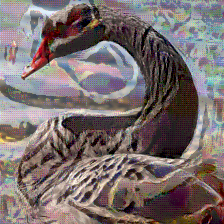| |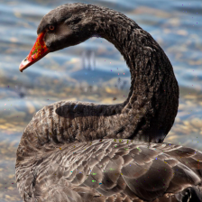|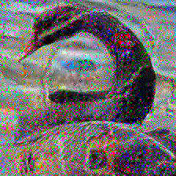 |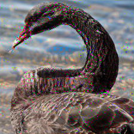|

|L<sub>1</sub>-JPEG|Elastic|Fog|Gabor|Snow|
|---|---|---|---|---|
|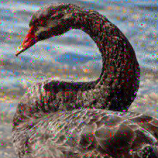 |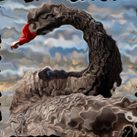||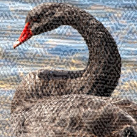 |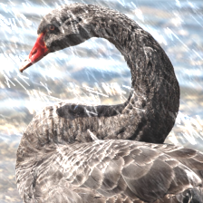 |

### Adversarial attacks for CIFAR-10

Sample images for class `dog` for each attack on CIFAR-10 are below.

|L<sub>&infin;</sub>|L<sub>2</sub>|L<sub>1</sub>|L<sub>&infin;</sub>-JPEG|L<sub>1</sub>-JPEG|Elastic|
|---|---|---|---|---|---|
|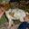| ||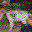 |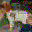|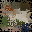|

### ImageNet-100 calibrations

We present calibrated distortion sizes and adversarially trained models for each of our attacks.  We use the ResNet-50 architecture on ImageNet-100, the 100-class subset of ImageNet-1K containing every 10th class by WordNet ID order.  Calibrated distortion sizes for each attack and links to adversarially trained models with these parameters are presented in the table below.  The calibrations are also included in `analysis/calibrations/imagenet-100/calibs.out`. Checkpoints for these adversarially trained models are available [here](https://drive.google.com/file/d/1TpxjHNRWi4vZUuUl76UeTwSvybPy_ACd).

|Distortion| &epsilon;<sub>1</sub>| &epsilon;<sub>2</sub> |&epsilon;<sub>3</sub> |&epsilon;<sub>4</sub> |&epsilon;<sub>5</sub> |&epsilon;<sub>6</sub> |
|---|---|---|---|---|---|---|
|L<sub>&infin;</sub>|1|2|4|8|16|32|
|L<sub>2</sub>|150|300|600|1200|2400|4800|
|L<sub>1</sub>|9562.5|19125|76500|153000|306000|612000|
|L<sub>&infin;</sub>-JPEG|0.0625|0.125|0.25|0.5|1|2|
|L<sub>2</sub>-JPEG|8|16|32|64|128|256|
|L<sub>1</sub>-JPEG|256|1024|4096|16384|65536|131072|
|Elastic|0.25|0.5|2|4|8|16|
|Fog|128|256|512|2048|4096|8192|
|Gabor|6.25|12.5|25|400|800|1600|
|Snow|0.0625|0.125|0.25|2|4|8|

The table below presents ATA values at the calibrated distortion sizes.  These values are sufficient to compute UAR on a new model using adversarial evaluation alone. 

|ATA values|&epsilon;<sub>1</sub>| &epsilon;<sub>2</sub> |&epsilon;<sub>3</sub> |&epsilon;<sub>4</sub> |&epsilon;<sub>5</sub> |&epsilon;<sub>6</sub> |
|---|---|---|---|---|---|---|
|ATA(L<sub>&infin;</sub>, &epsilon;)|84.6|82.1|76.2|66.9|40.1|12.9|
|ATA(L<sub>2</sub>, &epsilon;)|85.0|83.5|79.6|72.6|59.1|19.9|
|ATA(L<sub>1</sub>, &epsilon;)|84.4|82.7|76.3|68.9|56.4|36.1|
|ATA(L<sub>&infin;</sub>-JPEG, &epsilon;)|85.0|83.2|79.3|72.8|34.8|1.1|
|ATA(L<sub>2</sub>-JPEG, &epsilon;)|84.8|82.5|78.9|72.3|47.5|3.4|
|ATA(L<sub>1</sub>-JPEG, &epsilon;)|84.8|81.8|76.2|67.1|46.4|41.8|
|ATA(Elastic, &epsilon;)|85.9|83.2|78.1|75.6|57.0|22.5|
|ATA(Fog, &epsilon;)|85.8|83.8|79.0|68.4|67.9|64.7|
|ATA(Gabor, &epsilon;)|84.0|79.8|79.8|66.2|44.7|14.6|
|ATA(Snow, &epsilon;)|84.0|81.1|77.7|65.6|59.5|41.2|

### CIFAR-10 calibrations

For CIFAR-10, we use the ResNet-56 architecture on ImageNet-100.  Calibrated distortion sizes for each attack and links to adversarially trained models with these parameters are presented in the table below.  The calibrations are also included in `analysis/calibrations/cifar-10/calibs.out`. Checkpoints for these adversarially trained models are available [here](https://drive.google.com/file/d/1jfouhBa0qq0BmEbyWZwpwf_5jQigGE_U).

|Distortion| &epsilon;<sub>1</sub>| &epsilon;<sub>2</sub> |&epsilon;<sub>3</sub> |&epsilon;<sub>4</sub> |&epsilon;<sub>5</sub> |&epsilon;<sub>6</sub> |
|---|---|---|---|---|---|---|
|L<sub>&infin;</sub>|1|2|4|8|16|32|
|L<sub>2</sub>|40|80|160|320|640|2560|
|L<sub>1</sub>|195|390|780|1560|6240|24960|
|L<sub>&infin;</sub>-JPEG|0.03125|0.0625|0.125|0.25|0.5|1|
|L<sub>1</sub>-JPEG|2|8|64|256|512|1024|
|Elastic|0.125|0.25|0.5|1|2|8|

The table below presents ATA values at the calibrated distortion sizes.  These values are sufficient to compute UAR on a new model using adversarial evaluation alone. 

|ATA values|&epsilon;<sub>1</sub>| &epsilon;<sub>2</sub> |&epsilon;<sub>3</sub> |&epsilon;<sub>4</sub> |&epsilon;<sub>5</sub> |&epsilon;<sub>6</sub> |
|---|---|---|---|---|---|---|
|ATA(L<sub>&infin;</sub>, &epsilon;)|91.0|87.8|81.6|71.3|46.5|23.1|
|ATA(L<sub>2</sub>, &epsilon;)|90.1|86.4|79.6|67.3|49.9|17.3|
|ATA(L<sub>1</sub>, &epsilon;)|92.2|90.0|83.2|73.8|47.4|35.3|
|ATA(L<sub>&infin;</sub>-JPEG, &epsilon;)|89.7|87.0|83.1|78.6|69.7|35.4|
|ATA(L<sub>1</sub>-JPEG, &epsilon;)|91.4|88.1|80.2|68.9|56.3|37.7|
|ATA(Elastic, &epsilon;)|87.4|81.3|72.1|58.2|45.4|27.8|

## Citation

If you find this useful in your research, please consider citing:

    @article{kang2019robustness,
      title={Testing Robustness Against Unforeseen Adversaries},
      author={Daniel Kang and Yi Sun and Dan Hendrycks and Tom Brown and Jacob Steinhardt},
      journal={arXiv preprint arXiv:1908.08016},
      year={2019}
    }
